# FarmGo Architecture and Design Specification

Welcome to the FarmGo Platform architecture document. FarmGo is a full-stack, AI-powered agricultural logistics platform connecting Farmers with Transporters to move crops efficiently.

## 1. Project Directory Structure

```
farmgo-prototype/
├── docs/
│   └── ARCHITECTURE.md          # This file
├── backend/                     # FastAPI backend
│   ├── app/
│   │   ├── api/                 # Endpoints (auth, users, crops, orders)
│   │   │   ├── router.py
│   │   │   └── v1/
│   │   │       ├── auth.py
│   │   │       ├── users.py
│   │   │       ├── crops.py
│   │   │       └── orders.py
│   │   ├── core/                # Config, security, DB session
│   │   │   ├── config.py
│   │   │   ├── security.py
│   │   │   └── database.py
│   │   ├── crud/                # Database operations (CRUD)
│   │   ├── models/              # SQLAlchemy models (base, user, crop, order)
│   │   ├── schemas/             # Pydantic schemas (request/response validation)
│   │   ├── tests/               # Pytest suite
│   │   └── main.py              # FastAPI entrypoint
│   ├── alembic/                 # Alembic migrations
│   ├── alembic.ini
│   ├── requirements.txt
│   └── Dockerfile
└── frontend/                    # Vite + React frontend
    ├── public/
    ├── src/
    │   ├── assets/              # Logo, images, icons
    │   ├── components/          # Reusable UI components (shadcn/ui layout, etc.)
    │   │   ├── ui/              # shadcn base components
    │   │   └── shared/          # Navbar, Footer, Sidebar, ProtectedRoute
    │   ├── context/             # AuthContext, ThemeContext
    │   ├── hooks/               # Custom React hooks (useAuth, useFetch)
    │   ├── pages/               # Page components
    │   │   ├── Auth/            # Login, Register
    │   │   ├── Farmer/          # Dashboard, Add Crop, My Orders
    │   │   ├── Transporter/     # Dashboard, Available Jobs, My Deliveries
    │   │   ├── Admin/           # Admin Dashboard, Manage Users
    │   │   └── LandingPage.tsx
    │   ├── services/            # API clients (axios wrappers)
    │   ├── types/               # TypeScript interfaces
    │   ├── App.tsx
    │   ├── index.css
    │   └── main.tsx
    ├── tailwind.config.js
    ├── tsconfig.json
    ├── vite.config.ts
    └── package.json
```

## 2. Database Schema (ERD)

```mermaid
erDiagram
    USER {
        uuid id PK
        string email UK
        string password_hash
        string full_name
        string phone_number
        string role "ENUM: farmer, transporter, admin"
        string profile_picture_url
        datetime created_at
        datetime updated_at
    }

    FARMER_PROFILE {
        uuid id PK
        uuid user_id FK
        string farm_name
        string farm_location
        string farm_size
    }

    TRANSPORTER_PROFILE {
        uuid id PK
        uuid user_id FK
        string vehicle_type
        string vehicle_number
        float capacity_tons
    }

    CROP {
        uuid id PK
        uuid farmer_id FK
        string name
        string category "e.g., Grains, Vegetables, Fruits"
        float quantity_kg
        float price_per_kg
        string description
        string status "ENUM: available, pending_transport, sold, archived"
        string image_url
        datetime harvest_date
        datetime created_at
        datetime updated_at
    }

    ORDER {
        uuid id PK
        uuid crop_id FK
        uuid farmer_id FK
        uuid transporter_id FK "nullable"
        string pickup_address
        string delivery_address
        float delivery_distance_km
        float delivery_fee
        string status "ENUM: pending, accepted, in_transit, delivered, cancelled"
        datetime scheduled_pickup
        datetime actual_pickup
        datetime actual_delivery
        datetime created_at
        datetime updated_at
    }

    USER ||--o| FARMER_PROFILE : "has profile (if farmer)"
    USER ||--o| TRANSPORTER_PROFILE : "has profile (if transporter)"
    USER ||--o{ CROP : "owns"
    CROP ||--o{ ORDER : "belongs to"
    USER ||--o{ ORDER : "creates (farmer)"
    USER ||--o{ ORDER : "fulfills (transporter)"
```



### Table Descriptions

- **USER**: Stores credentials, roles, and basic information. Roles dictate UI dashboards and API privileges.
- **FARMER_PROFILE / TRANSPORTER_PROFILE**: Specific metadata for users depending on their role.
- **CROP**: Listings created by farmers to be sold/logistically shipped.
- **ORDER**: Represents the transport contract/job. A farmer requests transport for a crop, a transporter accepts the job, sets off to pick it up, and marks it delivered.

---

## 3. API Endpoints

### 3.1 Authentication & Users
- `POST /api/v1/auth/register` - Create a new user (Farmer or Transporter) and initialize their profile.
- `POST /api/v1/auth/login` - Obtain a JWT access token.
- `GET /api/v1/users/me` - Get profile of authenticated user.
- `PUT /api/v1/users/me` - Update profile details.
- `GET /api/v1/users` - [Admin] List all users.

### 3.2 Crops
- `POST /api/v1/crops` - [Farmer] Create a crop listing.
- `GET /api/v1/crops` - List crops (Farmers view their own, Transporters/Admins view all). Supports filtering by category/status.
- `GET /api/v1/crops/{id}` - Fetch details of a specific crop.
- `PUT /api/v1/crops/{id}` - [Farmer/Admin] Update a crop listing.
- `DELETE /api/v1/crops/{id}` - [Farmer/Admin] Delete a crop listing.

### 3.3 Orders (Logistics Jobs)
- `POST /api/v1/orders` - [Farmer] Create a transport order for a specific crop.
- `GET /api/v1/orders` - Get list of orders.
  - Farmers see orders they created.
  - Transporters see available orders (status `pending`) or orders they accepted.
  - Admins see all orders.
- `GET /api/v1/orders/{id}` - Get order details.
- `PATCH /api/v1/orders/{id}/accept` - [Transporter] Accept a pending transport order.
- `PATCH /api/v1/orders/{id}/status` - [Transporter/Admin] Update transport order status (`in_transit`, `delivered`, `cancelled`).
- `PUT /api/v1/orders/{id}` - [Farmer/Admin] Update pickup/delivery addresses or scheduled time before acceptance.
